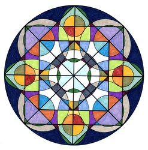
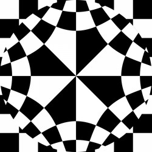

# giffer

"giffer" allows you to create unordinary GIF's from series of images.


### Prerequisites

Make sure you have installed at least Java 9(53.0+)

### Running

##### LINUX
Run
```
java -jar giffer-app.jar
```
Or, if you've cloned a repo
```
java -jar out/artifacts/giffer_app_jar/giffer-app.jar
```
## Usage

Take series of pictures which look similar





Launch the app and add this chosen images via *File->Open* menu  
Next, provide GIF width/height in fields on the right side of the main view  
Finally, choose GIF **mode** ("multi-image gif" in case you have multiple images), **warp** and **morphism**.  
Press *Create* or *GIF->Preview* and have fun :P  


- You can change order of images on the bottom pane via drag&drop
- You can select multiple images at once when using *File->Open*
- You can select delay between images and play with few other parameters

## Built With

* [Maven](https://maven.apache.org/) - Dependency Management

## Authors

* **Jan Gwinner** - *gif creator engine* :contribution ~ 40 %
* **Jerzy Skrzypek** - *GUI + handlers* :contribution ~ 20 %
* **Vladyslav Rachek** - *GUI + handlers* :contribution ~ 40%


## License
This project is licensed under the MIT License - see the [LICENSE.md](LICENSE.md) file for details

